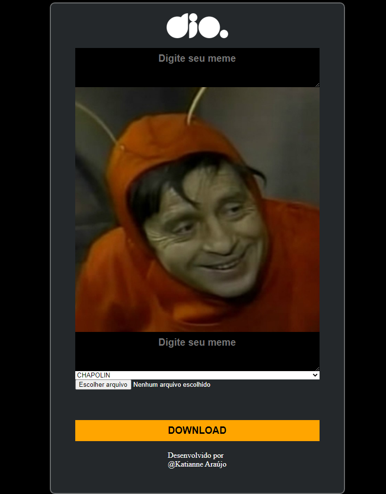
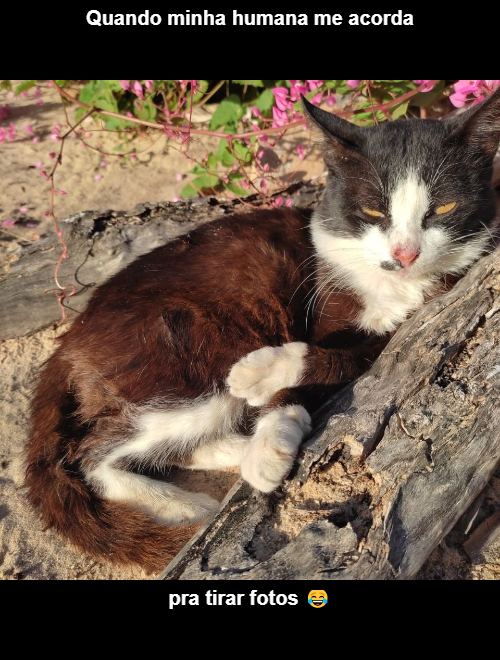

<h1 align="center"> Maquina de Memes</h1>

Desenvolvimento de uma pagina de personalização de memes. 
 
Desenvolvida durante a live da DIO.

 

  | 
| :---: | :---: |

> 💻 Acesse crie seus memes, faça o download e compartilhe com seus amigos 😄

[Clique aqui para acessar](https://katianne23.github.io/Maquina-de-memes/)

## 🚀 Tecnologias Utilizadas

- [HTML](https://developer.mozilla.org/pt-BR/docs/Web/HTML)
- [CSS](https://developer.mozilla.org/pt-BR/docs/Web/CSS)
- [JavaScript](https://developer.mozilla.org/pt-BR/docs/Web/JavaScript)

 

## :memo: Licença

Esse projeto está sob a licença MIT.
Rocketseat

---

Feito com ♥ by  katianne Araújo 
## ♥ Contato
 
 	
  
  
   
